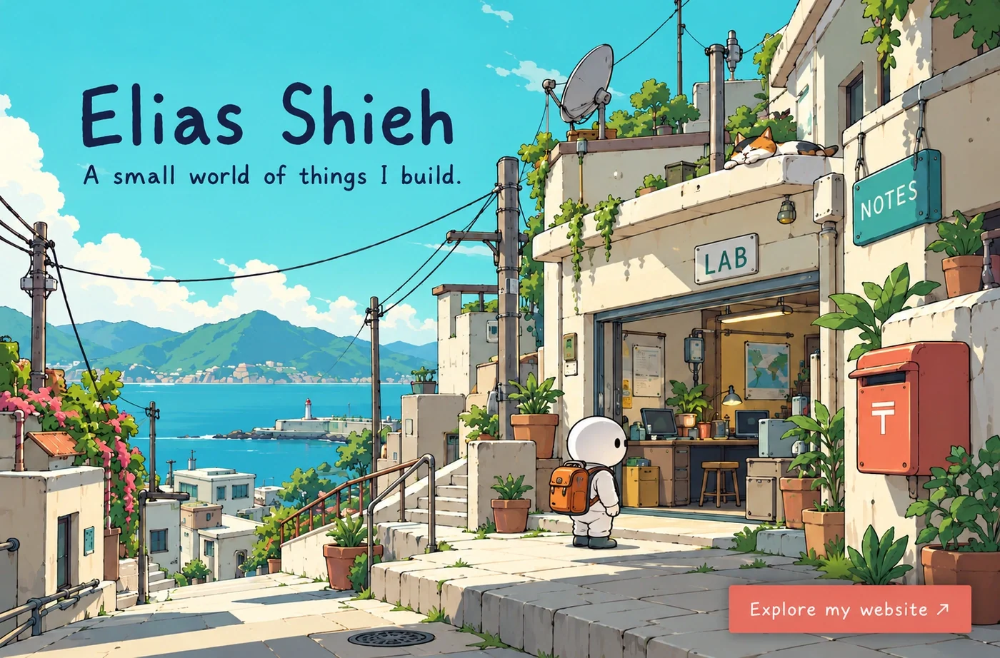
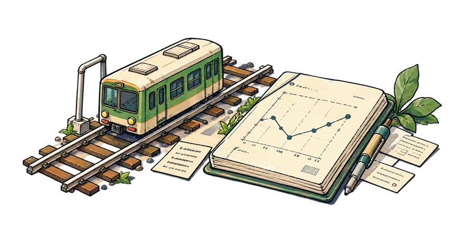
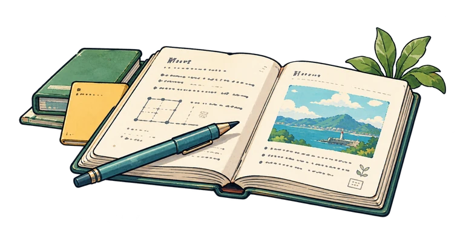

  

  <strong>Research tools, product experiments, and a little curiosity.</strong> 
  <a href="https://eliasshieh.com/">Explore my website ↗</a>

### Current explorations

<table>
  <tr>
    <td width="50%" valign="top">
      
      
<strong><a href="https://github.com/ting-hong-shieh/quantrail">QuantRail ↗</a></strong>

      
Tools for more inspectable quantitative research. In early development.

    </td>
    <td width="50%" valign="top">
      
      
<strong><a href="https://github.com/ting-hong-shieh/polish-open-source-prose">Polish Open-Source Prose ↗</a></strong>

      
Testing when an editing agent should leave text alone.

    </td>
  </tr>
</table>

---

**Merged upstream** · [NVIDIA NeMo](https://github.com/NVIDIA-NeMo/Switchyard/pull/389) · [RocketPy](https://github.com/RocketPy-Team/RocketPy/pull/1144) · [View contributions ↗](https://eliasshieh.com/oss/)

---

[Website ↗](https://eliasshieh.com/) &nbsp; · &nbsp; [Writing ↗](https://eliasshieh.com/writings/) &nbsp; · &nbsp; [GitHub ↗](https://github.com/ting-hong-shieh)

No straight line.

